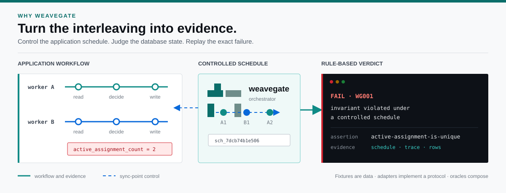
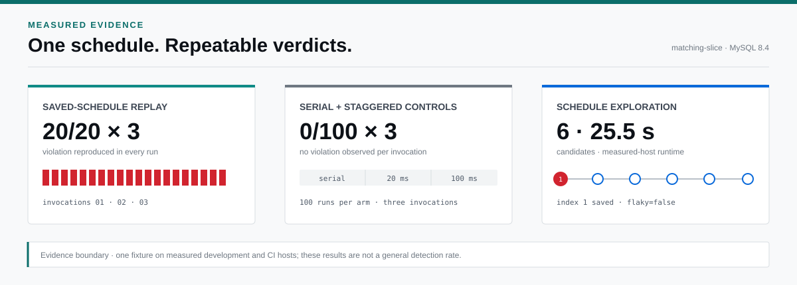
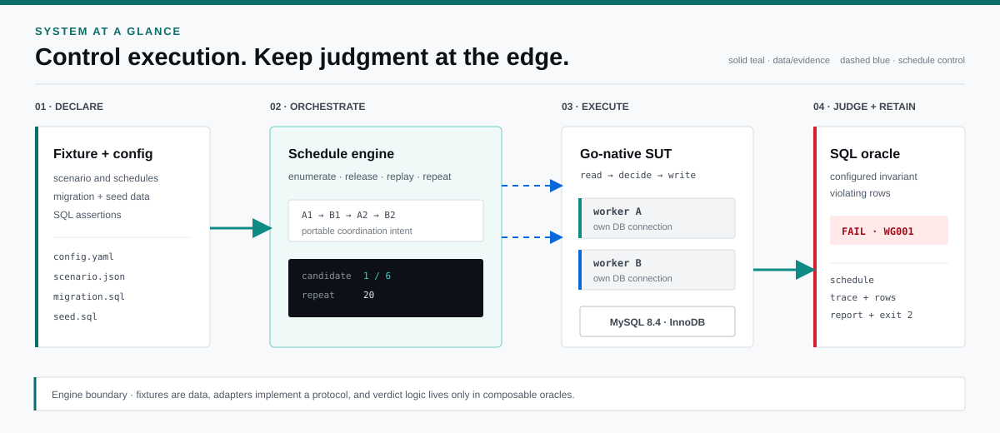
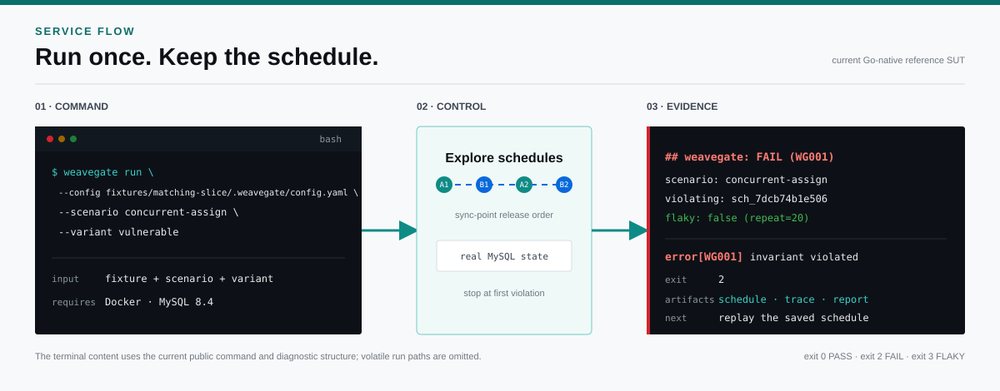

<!-- markdownlint-disable-file MD033 MD041 -->

<p align="center">
  
</p>

<p align="center">
  Deterministically replay the DB race, gate the deploy.
</p>

<p align="center">
  <a href="https://github.com/weavegate/weavegate/actions/workflows/smoke.yml?query=branch%3Amain"></a>
  <a href="https://github.com/weavegate/weavegate/releases"></a>
  
  
  
</p>

<p align="center">
  <a href="#overview">Overview</a> ·
  <a href="#results">Results</a> ·
  <a href="#how-it-works">How it works</a> ·
  <a href="#run-the-cli">Run the CLI</a>
</p>

<a id="overview"></a>

**weavegate** is a deterministic integration-test harness for application-level database races in transactional `read → decide → write` workflows. It explores the interleavings between sync-points you place, runs the workflow against real MySQL, and lets rule-based SQL oracles judge the resulting state. When an invariant breaks, it saves the release schedule, trace, violating rows, report, and CI exit code so the same failure—and the fix—can be replayed.



- **Find the order ·** bounded schedule exploration — expose the interleaving ordinary tests may miss.
- **Force the race ·** named sync-points — coordinate workers without timing sleeps.
- **Prove the outcome ·** SQL oracles and artifacts — retain the verdict, state, trace, and replay command.

See [Limitations](docs/limitations.md) for replay and PASS boundaries.

## Results



| Measurement | Result |
| --- | --- |
| **Replay · 20/20 × 3** | Every saved replay violated ([source](docs/experiments/baseline-comparison.md#measured-result)). |
| **Controls · 0/100 × 3** | Serial and 20/100 ms staggered runs did not ([source](docs/experiments/baseline-comparison.md#measured-result)). |
| **Explore · 6 candidates** | Index 1 yielded `sch_7dcb74b1e506`; `flaky=false`; **25.5 s** ([source](docs/experiments/exploration.md#reproduction)). |
| **Boundary · one fixture** | Measured hosts only; not a detection rate. |

See [Experiments](docs/README.md#measured-results) for methods and reproduction.

## How it works



1. **Declare ·** fixture data binds the scenario, migration, seed, and SQL assertions.
2. **Orchestrate ·** the schedule engine explores, replays, and repeats sync-point release orders.
3. **Execute ·** the Go-native adapter runs each worker with its own connection against real MySQL.
4. **Judge and retain ·** composable oracles emit the verdict, schedule, trace, rows, report, and exit code.

See [Architecture](docs/architecture.md#execution-flow) for details.

## Run the CLI



> **Pre-release:** requires Go 1.25+ and Docker/MySQL 8.4; interfaces may change before 1.0.

```console
$ go build -o weavegate ./cmd/weavegate
$ ./weavegate run --config fixtures/matching-slice/.weavegate/config.yaml --scenario concurrent-assign --variant vulnerable
## weavegate: FAIL (WG001)
```

- **Input ·** fixture — selects scenario, data, adapter, and oracle.
- **Output · exit 2** — `WG001` writes run evidence.
- **Replay ·** saved schedule — test vulnerable or fixed code.

See [Quickstart](docs/quickstart.md) for installs, output, and replay.

## Contributing / License

- **Contributing ·** fixtures are welcome — follow [Contributing](CONTRIBUTING.md).
- **Support ·** choose a route in [Support](SUPPORT.md).
- **License ·** Apache-2.0 — see [LICENSE](LICENSE).

See [changelog](CHANGELOG.md), [milestones](https://github.com/weavegate/weavegate/milestones), and [related work](docs/related-work.md).
